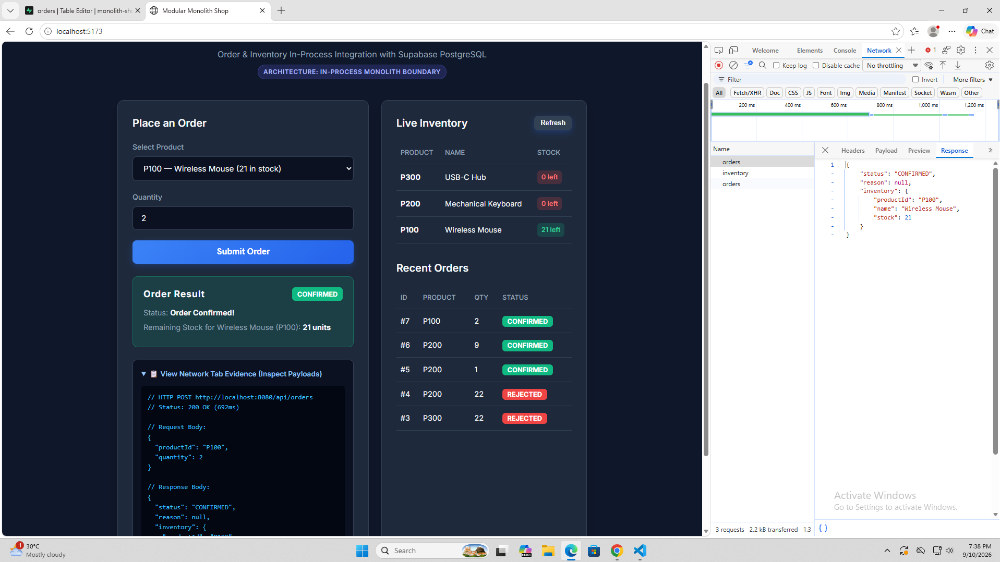
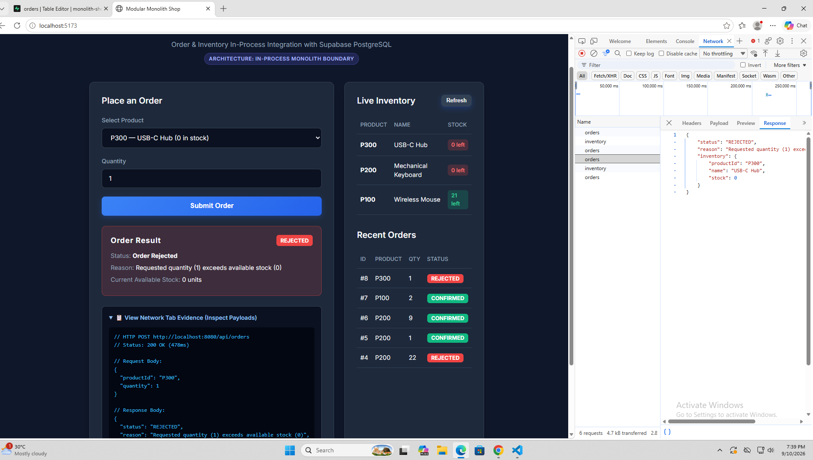

# Modular Monolith Integration with a React Frontend & Supabase

A production-grade Modular Monolith demonstrating three integration styles:
1. **Module-to-Module In-Process Integration**: Enforced architectural boundary between `Order` and `Inventory` modules running in the same JVM process without network hops.
2. **Service-to-Database Integration**: Spring Data JPA connecting to a shared cloud PostgreSQL database hosted on **Supabase** (with credential isolation).
3. **Client-to-Service Integration**: Modern **React + Vite** single-page application interacting with the backend via HTTP REST endpoints with CORS enabled.

---

## 🏛️ System Architecture

```
                       +-----------------------------------+
                       |         React Web Frontend        |
                       |       (Vite + React @ :5173)      |
                       +-----------------+-----------------+
                                         | HTTP REST (CORS)
                                         v
+-----------------------------------------------------------------------------------+
| Spring Boot Application (edu.cit.verano)                                          |
|                                                                                   |
|   +--------------------------------------+                                        |
|   | Order Module (edu.cit.verano.shop)   |                                        |
|   |   - OrderController                  |                                        |
|   |   - OrderService                     |                                        |
|   |   - Order (JPA Entity)               |                                        |
|   |   - OrderRepository                  |                                        |
|   +-------------------+------------------+                                        |
|                       | In-Process Call (Constructor-injected interface)          |
|                       v                                                           |
|   +-------------------------------------------+                                   |
|   | Inventory Module                          |                                   |
|   | (edu.cit.verano.inventory)                |                                   |
|   |   - InventoryService (public interface)   |                                   |
|   |   - InventoryServiceImpl                  |                                   |
|   |     (PACKAGE-PRIVATE: enforced boundary)  |                                   |
|   |   - InventoryItem (JPA Entity)            |                                   |
|   |   - InventoryRepository (package-private) |                                   |
|   +-------------------------------------------+                                   |
+--------------------------+--------------------------------------------------------+
                           | JDBC / JPA (SSL enabled)
                           v
             +---------------------------+
             |   Supabase (PostgreSQL)   |
             |   - inventory table       |
             |   - orders table          |
             +---------------------------+
```

### Module Boundary Enforcement
- **`edu.cit.verano.inventory.InventoryService`** is `public interface`: defines `getItem`, `reserve`, and `getAllItems`.
- **`edu.cit.verano.inventory.InventoryServiceImpl`** is **package-private** (`class InventoryServiceImpl implements InventoryService`). It lacks the `public` modifier, making it strictly inaccessible to classes outside `edu.cit.verano.inventory`.
- **`edu.cit.verano.shop.OrderService`** depends **exclusively** on the `InventoryService` interface via constructor injection. It cannot compile if it attempts to instantiate, cast to, or reference `InventoryServiceImpl`.

---

## 📦 Project Structure

```
Monolith Integration/
├── .env.example                # Template for Supabase environment variables
├── .gitignore                  # Keeps credentials (.env), build outputs, and node_modules out of Git
├── supabase_setup.sql          # SQL schema and baseline seed script
├── README.md                   # Documentation, setup guide, evidence, and reflection
├── backend/                    # Spring Boot 3.2 (Java 21) Modular Monolith
│   ├── pom.xml
│   ├── mvnw / mvnw.cmd
│   └── src/
│       ├── main/
│       │   ├── java/edu/cit/verano/
│       │   │   ├── ShopApplication.java            # Main entry point (@SpringBootApplication)
│       │   │   ├── inventory/                      # INVENTORY MODULE
│       │   │   │   ├── InventoryItem.java          # JPA Entity (inventory table)
│       │   │   │   ├── InventoryItemDto.java       # Public DTO for safe cross-module data
│       │   │   │   ├── ReservationResult.java      # Reservation outcome DTO
│       │   │   │   ├── InventoryRepository.java    # Package-private Spring Data Repository
│       │   │   │   ├── InventoryService.java       # Public Service Interface
│       │   │   │   ├── InventoryServiceImpl.java   # Package-private Service Implementation
│       │   │   │   └── InventorySeeder.java        # Startup seeder for baseline items
│       │   │   └── shop/                           # ORDER MODULE
│       │   │       ├── Order.java                  # JPA Entity (orders table)
│       │   │       ├── OrderRepository.java        # Spring Data Repository
│       │   │       ├── OrderRequest.java           # Order request DTO { productId, quantity }
│       │   │       ├── OrderResponse.java          # Order response DTO { status, reason, inventory }
│       │   │       ├── OrderService.java           # In-process coordinator calling InventoryService
│       │   │       └── OrderController.java        # REST Controller (POST /api/orders, GET /api/inventory)
│       │   └── resources/
│       │       └── application.properties          # Environment-driven database configuration
│       └── test/java/edu/cit/verano/
│           └── OrderIntegrationTest.java           # Automated tests for boundary & order flows
└── frontend/                   # React + Vite Client
    ├── package.json
    ├── vite.config.js
    ├── index.html
    └── src/
        ├── App.jsx             # UI form, product dropdown, result banner, network evidence inspect
        ├── index.css           # Modern, responsive styling
        └── main.jsx
```

---

## 🚀 Supabase Database Setup Steps

1. Go to [supabase.com](https://supabase.com) and create a free project (or log into your existing project).
2. Open the **SQL Editor** tab from the left navigation panel.
3. Open `supabase_setup.sql` from this repository, paste the contents into the Supabase SQL editor, and click **Run**:
   ```sql
   -- Create inventory table
   CREATE TABLE IF NOT EXISTS inventory (
       product_id VARCHAR(50) PRIMARY KEY,
       name VARCHAR(255) NOT NULL,
       stock INT NOT NULL CHECK (stock >= 0)
   );

   -- Seed required baseline products
   INSERT INTO inventory (product_id, name, stock) VALUES
       ('P100', 'Wireless Mouse', 25),
       ('P200', 'Mechanical Keyboard', 10),
       ('P300', 'USB-C Hub', 0)
   ON CONFLICT (product_id) DO UPDATE 
   SET name = EXCLUDED.name, stock = EXCLUDED.stock;

   -- Create orders table
   CREATE TABLE IF NOT EXISTS orders (
       order_id BIGSERIAL PRIMARY KEY,
       product_id VARCHAR(50) NOT NULL REFERENCES inventory(product_id),
       quantity INT NOT NULL CHECK (quantity > 0),
       status VARCHAR(20) NOT NULL,
       reason VARCHAR(255),
       created_at TIMESTAMP WITH TIME ZONE DEFAULT CURRENT_TIMESTAMP
   );
   ```
4. Retrieve your database connection settings:
   - Navigate to **Project Settings** -> **Database**.
   - Under **Connection String**, select **JDBC** (or **URI**).
   - Note the Host, Port (`5432` for direct or `6543` for connection pooler), Database name (`postgres`), User (`postgres`), and Password.
5. Create a `.env` file in the root directory (based on `.env.example`):
   ```properties
   SPRING_DATASOURCE_URL=jdbc:postgresql://db.<your-project-ref>.supabase.co:5432/postgres?sslmode=require
   SPRING_DATASOURCE_USERNAME=postgres
   SPRING_DATASOURCE_PASSWORD=your_actual_supabase_password
   ```
   *(Note: `.env` is listed in `.gitignore` and is never committed to GitHub).*

---

## 💻 Running the Application

### 1. Run Automated Backend Tests
Verify module boundary enforcement and order paths:
```bash
cd backend
./mvnw clean test          # On Linux/macOS
.\mvnw.cmd clean test      # On Windows
```
*Expected result:* All tests pass, validating that `InventoryServiceImpl` is package-private, confirmed orders decrement stock, and out-of-stock orders are rejected.

### 2. Start the Spring Boot Backend
```bash
cd backend
./mvnw spring-boot:run     # On Linux/macOS
.\mvnw.cmd spring-boot:run # On Windows
```
The backend starts at `http://localhost:8080`.

### 3. Start the React Frontend
In a separate terminal:
```bash
cd frontend
npm install
npm run dev
```
The frontend starts at `http://localhost:5173`.

---

## 📡 API Specification

### `POST /api/orders`
Places an order by checking and reserving inventory in-process, then persisting the order record.

- **Request Body**:
  ```json
  {
    "productId": "P100",
    "quantity": 2
  }
  ```

- **Confirmed Response (`200 OK`)**:
  ```json
  {
    "status": "CONFIRMED",
    "reason": null,
    "inventory": {
      "productId": "P100",
      "name": "Wireless Mouse",
      "stock": 23
    }
  }
  ```

- **Rejected Response (`200 OK`)**:
  ```json
  {
    "status": "REJECTED",
    "reason": "Requested quantity (1) exceeds available stock (0)",
    "inventory": {
      "productId": "P300",
      "name": "USB-C Hub",
      "stock": 0
    }
  }
  ```

### `GET /api/inventory`
Retrieves live stock counts for all products to populate the frontend dropdown and inventory table.

---

## 📸 Network Tab Evidence

### Scenario 1: Confirmed Order (P100 Wireless Mouse, Quantity 2)
- **Request URL**: `http://localhost:8080/api/orders`
- **HTTP Method**: `POST`
- **Status Code**: `200 OK`
- **Request Payload**:
  ```json
  {
    "productId": "P100",
    "quantity": 2
  }
  ```
- **Response Payload**:
  ```json
  {
    "status": "CONFIRMED",
    "reason": null,
    "inventory": {
      "productId": "P100",
      "name": "Wireless Mouse",
      "stock": 23
    }
  }
  ```
- **Database Effect**: Stock for `P100` decremented from 25 to 23. New record written to `orders` with `status = 'CONFIRMED'`.


```
+---------------------------------------------------------------------------------------------------+
| Headers | Payload | Preview | Response | Timing                                                    |
| Request URL: http://localhost:8080/api/orders                                                     |
| Request Method: POST                                                                              |
| Status Code: 200 OK                                                                               |
|                                                                                                   |
| Response Body:                                                                                    |
| { "status": "CONFIRMED", "reason": null, "inventory": { "productId": "P100", "stock": 23 } }      |
+---------------------------------------------------------------------------------------------------+
```

---

### Scenario 2: Rejected Order (P300 USB-C Hub, Quantity 1 - Out of Stock)
- **Request URL**: `http://localhost:8080/api/orders`
- **HTTP Method**: `POST`
- **Status Code**: `200 OK`
- **Request Payload**:
  ```json
  {
    "productId": "P300",
    "quantity": 1
  }
  ```
- **Response Payload**:
  ```json
  {
    "status": "REJECTED",
    "reason": "Requested quantity (1) exceeds available stock (0)",
    "inventory": {
      "productId": "P300",
      "name": "USB-C Hub",
      "stock": 0
    }
  }
  ```
- **Database Effect**: Stock for `P300` remains 0. New record written to `orders` with `status = 'REJECTED'` and reason `"Requested quantity (1) exceeds available stock (0)"`.


```
+---------------------------------------------------------------------------------------------------+
| Headers | Payload | Preview | Response | Timing                                                    |
| Request URL: http://localhost:8080/api/orders                                                     |
| Request Method: POST                                                                              |
| Status Code: 200 OK                                                                               |
|                                                                                                   |
| Response Body:                                                                                    |
| { "status": "REJECTED", "reason": "Requested quantity (1) exceeds available stock (0)" }          |
+---------------------------------------------------------------------------------------------------+
```

---

## 📝 Reflection

### 1. In-Process Integration vs. Separate Microservices Over a Network
Integrating the `Order` and `Inventory` modules in-process within a modular monolith yields fundamental architectural benefits that developers often take for granted. Most critically, in-process communication provides **atomic ACID transactions for free**. When `OrderService` invokes `InventoryService.reserve()`, both the inventory stock decrement and the order record creation can participate in a single local database transaction managed by Spring's `@Transactional`. If an exception occurs, the local transaction rolls back cleanly without partial writes. Furthermore, in-process execution has **near-zero latency** (measured in nanoseconds as direct memory pointer lookups), zero serialization/deserialization CPU overhead, and 100% call reliability (no packet loss or connection timeouts).

Conversely, splitting them into separate network-isolated microservices revokes these guarantees. To achieve the same consistency across a network, one must introduce:
- **Distributed Transactions or Saga Patterns**: Implementing an orchestration or choreography Saga with compensating transactions (e.g., if payment or fulfillment fails after an inventory reservation, an explicit compensating HTTP/gRPC call or event must unreserve the stock).
- **Network Resilience Mechanisms**: Handling transient network failures via exponential backoff retries, timeouts, circuit breakers (e.g., Resilience4j), and dead-letter queues.
- **Idempotency**: Providing unique idempotency keys on reservation requests so network retries do not accidentally deduct stock twice.
- **Observability and Messaging Infrastructure**: Deploying distributed tracing (OpenTelemetry/Zipkin) and message brokers (Kafka or RabbitMQ) for asynchronous decoupling.

### 2. The Significance of Package-Private Visibility on `InventoryServiceImpl`
Declaring `InventoryServiceImpl` with package-private visibility (`class InventoryServiceImpl implements InventoryService`) enforces a strict encapsulation boundary at compile time. In Java, classes without an explicit `public`, `private`, or `protected` modifier can only be accessed by classes within the exact same package (`edu.cit.verano.inventory`). 

If `InventoryServiceImpl` were declared `public`:
- Developers working on the `Order` module (`edu.cit.verano.shop`) could bypass the clean `InventoryService` interface contract and inject or instantiate `InventoryServiceImpl` directly.
- The `Order` module could inadvertently access internal implementation helper methods, non-contract state, or package internals, creating hidden, tight temporal and structural coupling.
- Architectural erosion would rapidly occur: any internal refactoring to `InventoryServiceImpl` (such as caching strategies or repository query alterations) would break the `Order` module.

By keeping `InventoryServiceImpl` package-private, Spring's component scanning still registers the bean within the application context, but the Java compiler guarantees that `OrderService` can depend **only** on the public `InventoryService` interface via constructor injection.

### 3. Extracting Inventory into its Own Microservice: When and How
#### When to Extract:
Extraction is warranted when clear organizational or operational inflection points are reached:
1. **Asymmetric Scalability & Traffic**: The Inventory module handles massive read traffic (e.g., millions of catalogue browsing queries per second) compared to low-volume order write transactions, justifying dedicated auto-scaling compute and read-replicas.
2. **Team Autonomy & Velocity**: Separate engineering teams own the domains. Independent codebases allow teams to deploy updates without coordinating deployment schedules or risking regressions in other modules.
3. **Different Technology Demands**: The Inventory service may require a specialized database engine (e.g., Redis for high-speed cache counters or DynamoDB) distinct from the relational order database.

#### What Would Need to Change in Code:
1. **Replace In-Process Interface with an HTTP/gRPC Client**: Instead of injecting the local `InventoryService` Java bean, `OrderService` would inject a remote client (such as Spring Cloud OpenFeign, Spring 6 `RestClient`, or gRPC stubs) configured with service discovery (Eureka/Consul) or DNS endpoints.
2. **Split Data Storage**: Extract the `inventory` table from the shared Supabase instance into an independent Inventory microservice database, strictly honoring the "Database-per-Service" pattern.
3. **Implement Asynchronous Compensation (Saga)**: Refactor `OrderService` to handle asynchronous HTTP status codes, network timeouts, and publish domain events (e.g., `OrderCancelledEvent`) to trigger inventory restocking if downstream processing fails.
4. **Independent Repositories and CI/CD**: Split the single Maven build into separate deployable artifacts (Docker containers) with independent deployment pipelines.

